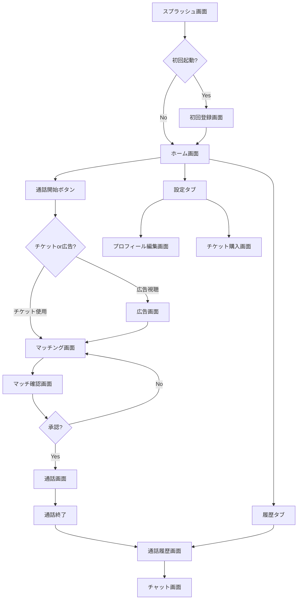

# KOEMO 画面遷移図・UI仕様

## 1. 画面一覧

### 1.1 主要画面
1. **スプラッシュ画面** - アプリ起動時
2. **初回登録画面** - プロフィール設定
3. **ホーム画面** - メイン画面
4. **マッチング画面** - 相手検索中
5. **マッチ確認画面** - 相手プレビュー
6. **通話画面** - 音声通話中
7. **通話履歴画面** - 履歴一覧
8. **チャット画面** - メッセージ
9. **プロフィール編集画面** - 設定
10. **チケット購入画面** - 課金

## 2. 画面遷移フロー



## 3. 各画面詳細仕様

### 3.1 スプラッシュ画面

**目的**: アプリ起動時の初期化処理

**UI要素**:
- アプリロゴ（中央配置）
- ローディングインジケーター
- バージョン番号（下部）

**処理**:
1. デバイスID確認
2. 認証状態チェック
3. 初回起動判定

### 3.2 初回登録画面

**目的**: 最小限のプロフィール情報収集

**UI要素**:
```
┌─────────────────────────┐
│     プロフィール設定      │
├─────────────────────────┤
│                         │
│  ニックネーム:          │
│  [_______________]      │
│                         │
│  性別:                  │
│  ○ 男性 ○ 女性 ○ その他  │
│                         │
│  年齢:                  │
│  [▼ 選択してください]     │
│                         │
│  地域:                  │
│  [▼ 選択してください]     │
│                         │
│  [  始める  ]           │
│                         │
└─────────────────────────┘
```

**バリデーション**:
- ニックネーム: 1-20文字、絵文字可
- 性別: 必須選択
- 年齢: 18歳以上
- 地域: オプション

### 3.3 ホーム画面

**目的**: アプリのメインハブ

**UI要素**:
```
┌─────────────────────────┐
│  🎫 5  KOEMO  ⚙️        │
├─────────────────────────┤
│                         │
│                         │
│      ┌─────────┐       │
│      │   📞    │       │
│      │  話す   │       │
│      └─────────┘       │
│                         │
│  「誰かと話したい」      │
│  そんな時にワンタップ     │
│                         │
├─────────────────────────┤
│  通話  │  履歴  │  設定  │
└─────────────────────────┘
```

**機能**:
- 通話ボタン: 中央に大きく配置
- チケット残数: 左上に表示
- タブバー: 下部固定

### 3.4 マッチング画面

**目的**: 相手検索中の待機画面

**UI要素**:
```
┌─────────────────────────┐
│      マッチング中...      │
├─────────────────────────┤
│                         │
│     ⟳ アニメーション      │
│                         │
│   相手を探しています      │
│                         │
│   予想待ち時間: 5秒      │
│                         │
│   [キャンセル]          │
│                         │
└─────────────────────────┘
```

**アニメーション**:
- パルスアニメーション
- 検索インジケーター

### 3.5 マッチ確認画面

**目的**: 相手確認と承認

**UI要素**:
```
┌─────────────────────────┐
│    マッチしました！       │
├─────────────────────────┤
│                         │
│      👤                │
│    太郎さん             │
│                         │
│  この方と通話を          │
│  始めますか？            │
│                         │
│  [スキップ] [通話する]   │
│                         │
│  自動接続まで 10秒       │
└─────────────────────────┘
```

**カウントダウン**:
- 10秒タイマー
- 自動承認機能

### 3.6 通話画面

**目的**: 音声通話インターフェース

**UI要素**:
```
┌─────────────────────────┐
│      通話中 03:45       │
├─────────────────────────┤
│                         │
│        👤              │
│      太郎さん           │
│      25歳              │  ← 30秒後表示
│      東京都             │  ← 60秒後表示
│                         │
│                         │
│  🔇  📢  ⚠️  📞       │
│ ミュート スピーカー 通報 終了│
└─────────────────────────┘
```

**段階的開示**:
- 0秒: ニックネームのみ
- 30秒: +年齢
- 60秒: +地域
- 180秒: フルプロフィール

**操作ボタン**:
- ミュート: マイクON/OFF
- スピーカー: スピーカー/イヤホン切替
- 通報: 不適切ユーザー報告
- 終了: 通話切断

### 3.7 通話履歴画面

**目的**: 24時間以内の通話履歴表示

**UI要素**:
```
┌─────────────────────────┐
│       通話履歴          │
├─────────────────────────┤
│ ┌─────────────────────┐ │
│ │ 👤 太郎さん         │ │
│ │ 3分25秒 - 10分前    │ │
│ │ [メッセージ] [通話]  │ │
│ └─────────────────────┘ │
│                         │
│ ┌─────────────────────┐ │
│ │ 👤 花子さん         │ │
│ │ 15分10秒 - 2時間前  │ │
│ │ [メッセージ] [通話]  │ │
│ └─────────────────────┘ │
└─────────────────────────┘
```

**リスト項目**:
- プロフィール情報
- 通話時間・経過時間
- アクションボタン

### 3.8 チャット画面

**目的**: テキストメッセージ交換

**UI要素**:
```
┌─────────────────────────┐
│  < 太郎さん            │
├─────────────────────────┤
│                         │
│  こんにちは！           │
│  楽しかったです  10:30  │
│                         │
│         ありがとう！ 😊  │
│         10:31          │
│                         │
│  24時間後に削除されます  │
├─────────────────────────┤
│ [メッセージを入力] [送信] │
└─────────────────────────┘
```

**機能**:
- リアルタイムメッセージ
- 既読表示なし
- 24時間自動削除通知

### 3.9 プロフィール編集画面

**目的**: プロフィール情報の変更

**UI要素**:
- ニックネーム編集
- 年齢・地域変更
- アカウント削除

### 3.10 チケット購入画面

**目的**: 広告スキップチケット購入

**UI要素**:
```
┌─────────────────────────┐
│     チケット購入         │
├─────────────────────────┤
│                         │
│  広告なしで通話！        │
│                         │
│  ○ 5枚  ¥480          │
│  ○ 10枚 ¥840 (16%お得) │
│  ○ 20枚 ¥1,480 (26%お得)│
│                         │
│  [購入する]             │
│                         │
│  ・購入はApp Store経由   │
│  ・自動更新なし          │
└─────────────────────────┘
```

## 4. UI/UXガイドライン

### 4.1 カラーパレット
- Primary: #007AFF (iOS Blue)
- Secondary: #34C759 (Success Green)
- Warning: #FF3B30 (Red)
- Background: #F2F2F7
- Text: #000000 / #8E8E93

### 4.2 タイポグラフィ
- Title: SF Pro Display Bold 28pt
- Body: SF Pro Text Regular 17pt
- Caption: SF Pro Text Regular 13pt

### 4.3 アニメーション
- 画面遷移: 0.3秒
- ボタンタップ: 0.1秒
- ローディング: 無限ループ

### 4.4 アクセシビリティ
- VoiceOver対応
- Dynamic Type対応
- 最小タップ領域: 44x44pt

## 5. エラー処理

### 5.1 ネットワークエラー
```
アラート:
「接続エラー」
「インターネット接続を確認してください」
[OK]
```

### 5.2 マッチングタイムアウト
```
アラート:
「マッチング失敗」
「現在相手が見つかりません。
 もう一度お試しください」
[OK]
```

### 5.3 通話接続エラー
```
アラート:
「通話接続エラー」
「通話を開始できませんでした」
[再試行] [キャンセル]
```